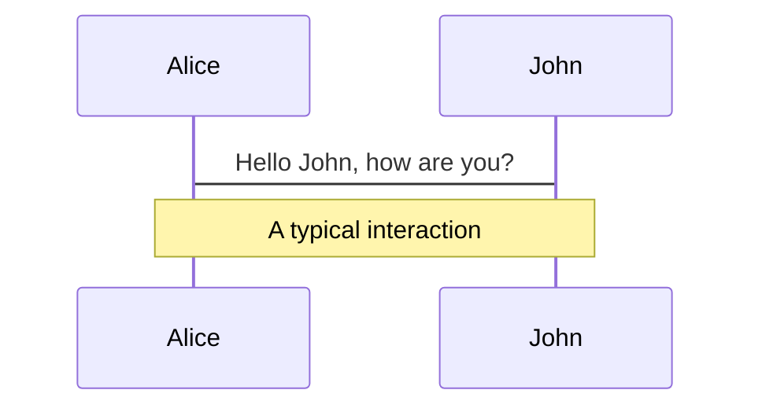
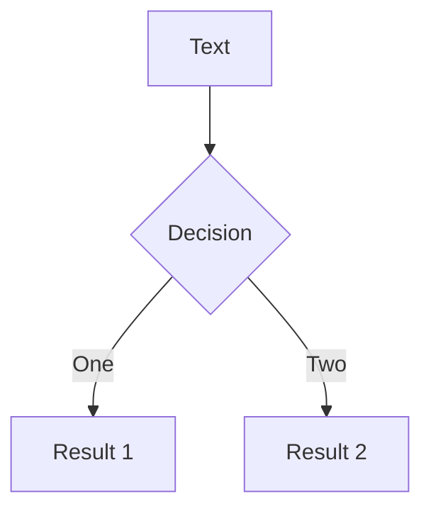
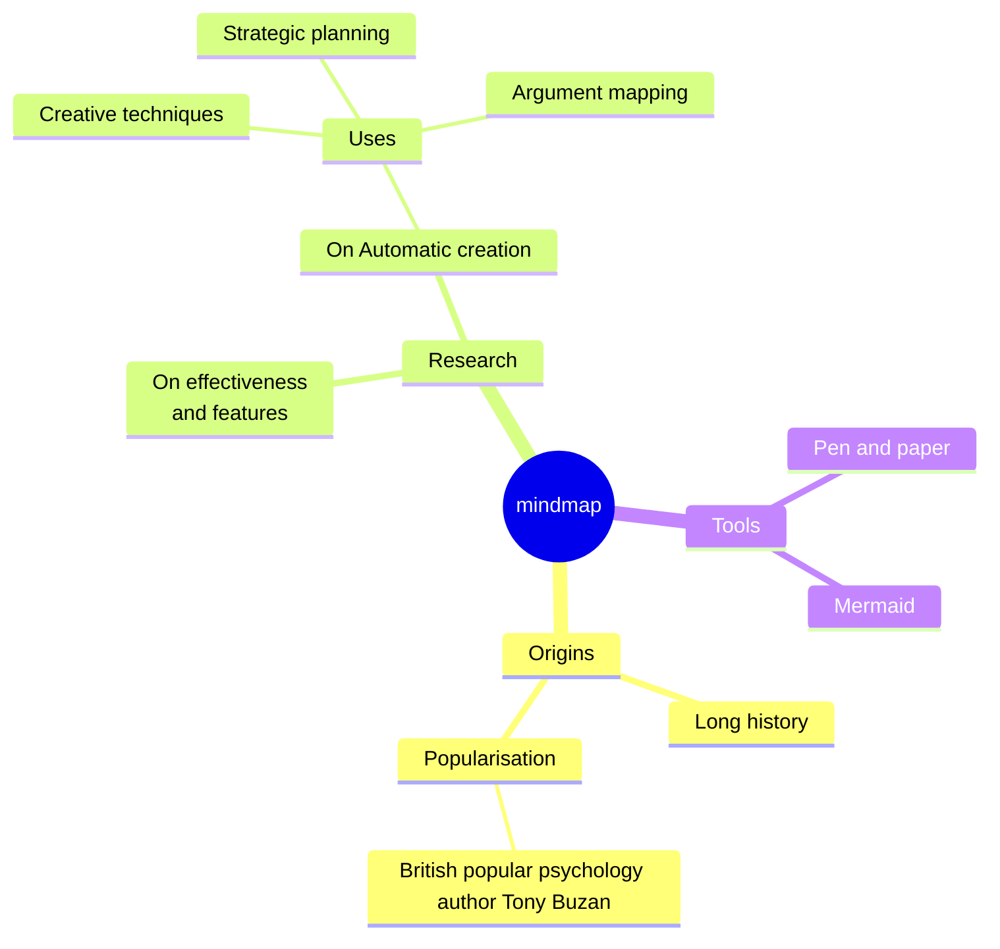
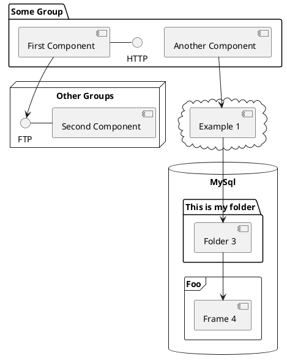

---
# You can also start simply with 'default'
theme: seriph
# random image from a curated Unsplash collection by Anthony
# like them? see https://unsplash.com/collections/94734566/slidev
background: https://cover.sli.dev
# some information about your slides (markdown enabled)
title: 提升開發效率的利器
info: |
  ## TypeScript + ESLint + Prettier
  讓 JavaScript 開發更安全、更高效的工具組合
# enabled pdf downloading in SPA build, can also be a custom url
download: true
# filename of the export file
exportFilename: frontend structure exported
colorSchema: dark
fonts:
  sans: Roboto
  serif: Roboto Slab
  mono: Fira Code
# apply unocss classes to the current slide
class: text-center
# https://sli.dev/features/drawing
drawings:
  persist: false
# slide transition: https://sli.dev/guide/animations.html#slide-transitions
transition: slide-left
# enable MDC Syntax: https://sli.dev/features/mdc
mdc: true
# open graph
# seoMeta:
#  ogImage: https://cover.sli.dev
---

# 提升開發效率的前端三本柱

## TypeScript + ESLint + Prettier

_讓 JavaScript 開發更安全、更高效_

<div class="pt-8">
  <span class="px-2 py-1 rounded cursor-pointer" @click="$slidev.nav.next">
    Let's roll. <carbon:arrow-right class="inline"/>
  </span>
</div>

> "Simple code is the best code." — Kent Beck

<div class="abs-br m-6 text-xl">
  <button @click="$slidev.nav.openInEditor()" title="Open in Editor" class="slidev-icon-btn">
    <carbon:edit />
  </button>
  <a href="https://github.com/davelin18yufan/typescript_eslint_slide" target="_blank" class="slidev-icon-btn">
    <carbon:logo-github />
  </a>
</div>

<!--
The last comment block of each slide will be treated as slide notes. It will be visible and editable in Presenter Mode along with the slide. [Read more in the docs](https://sli.dev/guide/syntax.html#notes)
-->

---
transition: fade-out
---

# 事情是這樣發生的

<div class="" 
v-motion
v-click="1"
:initial="{ x: -100, y: 40, opacity: 0 }"
:enter="{ x:0, y: 0, opacity: 1, transition: {delay: 200} }">
場景一：神秘的變數危機 🎰
</div>

<div class="text-gray-300" 
v-motion
v-click="2"
:initial="{ y: 40, opacity: 0 }"
:enter="{ y: 0, opacity: 1, transition: {delay: 200} }">
小龍在 .NET 專案中，從 HTML 
script 標籤引入了一個 <code>typecode1</code> 到 <code>typecode10</code>，完全不知道它們是什麼，也找不到來源！
</div>

<div 
v-motion
v-click="3"
:initial="{ y: 40, opacity: 0 }"
:enter="{ y: 0, opacity: 1, transition: {delay: 200} }">

```javascript {monaco} { editorOptions: { wordWrap:'on'} }
function addMember(course) {
  course.typecode = typecode1 // 這是什麼？數字？字串？物件？
  // course 無法得知他是甚麼或是裡面有甚麼，必須要往上翻檔案
  sendToApi(course) // 送出後只能祈禱伺服器不炸
}

// 每次送出 API，小龍都得重啟伺服器、打開 DevTools 慢慢試，效率低到像在玩「俄羅斯輪盤」！
```

</div>

<div
  class="mx-auto text-center mt-8 p-6 rounded-lg bg-gray-800 bg-opacity-60 shadow-lg"
  v-motion
  v-click="[4]"
  :initial="{ x: 100, y: -200, opacity: 0 }"
  :enter="{ x: 0, opacity: 1, transition: { delay: 200 } }"
  :leave="{ x:100, opacity:0 }"
>
  <h3 class="text-2xl font-bold mb-4 text-blue-300">小龍的痛點 📱</h3>
  <ul class="text-left text-lg leading-relaxed space-y-2 text-gray-200 mx-auto max-w-2xl">
    <li>
      <span class="font-semibold text-yellow-300">🎲 typecode 來源不明：</span>
      完全靠猜測，塞 console.log 去送出 API 後才知對錯
    </li>
    <li>
      <span class="font-semibold text-pink-300">😰 效率低下：</span>
      每次測試都要重啟伺服器，浪費時間
    </li>
    <li>
      <span class="font-semibold text-red-400">💥 Bug 頻發：</span>
      各式型別錯誤導致API處理失敗
    </li>
    <li>
      <span class="font-semibold text-green-300">🔍 80% 時間在試錯：</span>
      小龍快被逼瘋
    </li>
  </ul>
</div>

<div
  class="text-slate-300 text-center"
  v-motion
  v-click="5"
  :initial="{ x: 100, y: -100, opacity: 0 }"
  :enter="{ x: 0,y:-250, opacity: 1, transition: { delay: 200 } }"
>
小龍的 OS：
「X!^@#$^!!! 這 typecode 到底是誰寫的？為什麼沒人告訴我它是什麼！」
<br/>
「註解哩，我是要通靈嗎？」
</div>

<!--
Here is another comment.
-->

---
transition: slide-up
layout: center
---

<h3 class="text-yellow-300">"Good code should be as clear as prose." — Robert C. Martin</h3>

> _好的程式碼應該像散文一樣清晰。_

---
transition: fade
---

# 小龍的困擾之二 🤯

<div class="" 
v-motion
v-click="1"
:initial="{ x: -100, y: 40, opacity: 0 }"
:enter="{ x:0, y: 0, opacity: 1, transition: {delay: 200} }">
場景二：使用者操作的詭異 Bug 🔍
</div>

<div class="text-gray-300" 
v-motion
v-click="2"
:initial="{ y: 40, opacity: 0 }"
:enter="{ y: 0, opacity: 1, transition: {delay: 200} }">
小龍收到了一張 Bug 單：按鈕點擊後顯示成功但卻沒有做事 !?
</div>

<div 
v-motion
v-click="3"
:initial="{ y: 40, opacity: 0 }"
:enter="{ y: 0, opacity: 1, transition: {delay: 200} }">

```javascript {*|*|*|*|*|3,10,17}
function deleteMember() {
  // 取值
  var memNo = $("#input").data("memno")
  var course = $("course").val()
  var description = $("#description").val()
  var memName = $("#name").val()
  var depNo = $("#select").data("code")
  // 建檔人
  var account = sessionStorage.getItem("ma")
  var memNo = sessionStorage.getItem("memno")
  var bMemName = sessionStorage.getItem("memName")
  var type = WebUI.GetQueryString("type")
  if (!depNo) alert("請選擇單位")
  if (!memName) alert("請選擇人員")
  // ...其他檢查

  var inParam = $.param({ memNo, account, bMemName,memName, depNo, description})
  var data = sendDeleteRequest(inParam) // 送出刪除請求
  if (!data.ErrorMessage) alert("儲存成功")
}
```

</div>

<arrow v-click="[4]" x1="555" y1="200" x2="360" y2="230" color="#953" width="2" arrowSize="1" />
<arrow v-click="[4]" x1="585" y1="310" x2="400" y2="358" color="#953" width="2" arrowSize="1" />

<div
  class="text-slate-300 text-center bg-slate-800 p-2 max-w-lg rounded-sm"
  v-motion
  v-click="6"
  :initial="{ x: 100, y: -100, opacity: 0 }"
  :enter="{ x: 330,y:-500, opacity: 1, transition: { delay: 200 } }"
>
小龍找了兩小時才發現：<code>var</code> 重複宣告導致 <code>memNo</code> 被覆蓋，API 送出錯誤資料，按鈕功能異常！
</div>

---
transition: slide-left
layout: center
---

<div class="max-w-3xl px-1">
<h3 class="text-yellow-300">"The quality of your code determines the cost of future maintenance." — Martin Fowler</h3>

> *程式碼的品質決定了未來的維護成本。*

</div>

---
transition: slide-down
---

# 小龍的困擾之三 🤯

<div class="" 
v-motion
:initial="{ x: -100, y: 40, opacity: 0 }"
:enter="{ x:0, y: 0, opacity: 1, transition: {delay: 400} }">
場景二：接手維護別人的專案 ⚔️
</div>

<div class="text-gray-300" 
v-motion
:initial="{ y: 40, opacity: 0 }"
:enter="{ y: 0, opacity: 1, transition: {delay: 400} }">
  小龍接手一個同事留下的專案，但是裡面光是條件判斷就有 n 種寫法
</div>

````md magic-move {lines:true}
```javascript
function grade(score) {
  var result;

  if (score > 90) {
    result = 'A';
  } else {
    if (score > 80) {
      result = 'B';
    } else {
      if (score > 70) {
        result = 'C';
      } else {
        result = 'F';
      }
    }
  }

  return result;
}

```

```javascript
function grade(score) {
  if (score > 90) return 'A'
  else if (score > 80) {
    return 'B';
  } else if (score > 70) {
    return 'C';
  }

  return 'F';
}

```
```javascript
const grade = (score) => {
  if (score > 90) return 'A'
  if (score > 80) return 'B'
  if (score > 70) return 'C'
  else {
    return 'F' 
  }
}

```
```javascript
//🔴 版本一：老式寫法
function grade(score) {
  // 不是 ES6+
  var result; // 使用 var

  if (score > 90) {
    result = 'A';
  } else {      
    // 過度巢狀
    if (score > 80) {
      result = 'B';
    } else {
      if (score > 70) {
        result = 'C';
      } else {
        result = 'F'; // 回傳方式固定但可簡化
      }
    }
  }

  return result;
}

```
```javascript
// 🟡 版本二：中期寫法，有改善但風格仍不一致
function grade(score) {
  if (score > 90) return 'A'
  // 還是有巢狀但比之前少
  else if (score > 80) {  
    return 'B';      // 使用 return 時風格不一致（有些單行、有些 block）
  } else if (score > 70) {
    return 'C';
  }

  return 'F';
}

```

```javascript
// 🟠 版本三：箭頭函式但缺乏可讀性與一致性
const grade = (score) => {
  if (score > 90) return 'A'
  if (score > 80) return 'B'
  if (score > 70) return 'C'
  else { // 混合 else 與早期 return
    return 'F' // 有人不喜歡在前面 if 省略 else，這裡反而加了，也不必要
  }
}

```
```javascript
// ✅ 建議最佳寫法：ESLint 推薦風格一致 + 易讀
const grade = (score) => {
  if (score > 90) return 'A';
  if (score > 80) return 'B';
  if (score > 70) return 'C';
  return 'F';
};
// 優點：
//     ✅ 使用 const 宣告（ES6+）
//     ✅ 單一 return style，風格一致
//     ✅ 無不必要巢狀
//     ✅ 簡短易讀

```
````
<div
  class="text-slate-300 bg-slate-800 px-6 py-2 rounded-md text-left leading-relaxed shadow-md space-y-3"
  v-motion
  v-click="7"
  :initial="{ x: 100, y: -80, opacity: 0 }"
  :enter="{ x: 0, y: 0, opacity: 1, transition: { delay: 200 } }"
>
  <p>🔥 <strong class="text-white">衝突不斷：</strong> 每個人有自己的風格</p>
  <p>⏰ <strong class="text-white">效率低落：</strong> 邏輯問題被格式掩蓋</p>
  <p>🤯 <strong class="text-white">新人困惑：</strong> 無從下手、不知道照誰的標準改</p>
</div>

<div
  class="text-slate-300 bg-gray-800 px-6 py-4 rounded-md leading-relaxed space-y-4 shadow-lg"
  v-motion
  v-click="8"
  :initial="{ x: 100, y: -80, opacity: 0 }"
  :enter="{ x: 0, y: -230, opacity: 1, transition: { delay: 200 } }"
>
  <p class="text-lg font-semibold text-yellow-300">👨‍💼 假設是有主管在 Code Review，場面可能是這樣的：</p>

  <ul class="space-y-2 pl-4 list-disc list-inside text-base">
    <li>
      <strong class="text-rose-400">主管：</strong>
      「這縮排是怎麼回事？<code>if-else</code>是要包到隔壁去嗎怎麼這麼深，我眼睛度數已經夠深了 😩」
    </li>
    <li>
      <strong class="text-sky-400">小龍：</strong>
      「誰又用 <code class="text-orange-300">var</code> 了？不是說好用 <code class="text-green-300">const</code>？」
    </li>
    <li>
      <strong class="text-purple-400">小凱：</strong>
      「單引號、雙引號能不能統一一下？」
    </li>
    <li>
      <strong class="text-gray-400">菜鳥：</strong>
      「我不知道要跟誰的風格…… 😥」
    </li>
  </ul>
</div>

---
transition: slide-left
layout: center
---

<h3 class="text-yellow-300">"Consistency is the foundation of effective teamwork." — Douglas Crockford</h3>

> _一致性是團隊協作的基石。_


---

## level: 2

# Shiki Magic Move

Powered by [shiki-magic-move](https://shiki-magic-move.netlify.app/), Slidev supports animations across multiple code snippets.

Add multiple code blocks and wrap them with <code>````md magic-move</code> (four backticks) to enable the magic move. For example:

````md magic-move {lines: true}
```ts {*|2|*}
// step 1
const author = reactive({
  name: "John Doe",
  books: [
    "Vue 2 - Advanced Guide",
    "Vue 3 - Basic Guide",
    "Vue 4 - The Mystery",
  ],
})
```

```ts {*|1-2|3-4|3-4,8}
// step 2
export default {
  data() {
    return {
      author: {
        name: "John Doe",
        books: [
          "Vue 2 - Advanced Guide",
          "Vue 3 - Basic Guide",
          "Vue 4 - The Mystery",
        ],
      },
    }
  },
}
```

```ts
// step 3
export default {
  data: () => ({
    author: {
      name: "John Doe",
      books: [
        "Vue 2 - Advanced Guide",
        "Vue 3 - Basic Guide",
        "Vue 4 - The Mystery",
      ],
    },
  }),
}
```

Non-code blocks are ignored.

```vue
<!-- step 4 -->
<script setup>
const author = {
  name: "John Doe",
  books: [
    "Vue 2 - Advanced Guide",
    "Vue 3 - Basic Guide",
    "Vue 4 - The Mystery",
  ],
}
</script>
```
````

---

# Components

<div grid="~ cols-2 gap-4">
<div>

You can use Vue components directly inside your slides.

We have provided a few built-in components like `<Tweet/>` and `<Youtube/>` that you can use directly. And adding your custom components is also super easy.

```html
<Counter :count="10" />
```

<!-- ./components/Counter.vue -->
<Counter :count="10" m="t-4" />

Check out [the guides](https://sli.dev/builtin/components.html) for more.

</div>
<div>

```html
<Tweet id="1390115482657726468" />
```

<Tweet id="1390115482657726468" scale="0.65" />

</div>
</div>

<!--
Presenter note with **bold**, *italic*, and ~~striked~~ text.

Also, HTML elements are valid:
<div class="flex w-full">
  <span style="flex-grow: 1;">Left content</span>
  <span>Right content</span>
</div>
-->

---

## class: px-20

# Themes

Slidev comes with powerful theming support. Themes can provide styles, layouts, components, or even configurations for tools. Switching between themes by just **one edit** in your frontmatter:

<div grid="~ cols-2 gap-2" m="t-2">

```yaml
---
theme: default
---
```

```yaml
---
theme: seriph
---
```


</div>

Read more about [How to use a theme](https://sli.dev/guide/theme-addon#use-theme) and
check out the [Awesome Themes Gallery](https://sli.dev/resources/theme-gallery).

---

# Clicks Animations

You can add `v-click` to elements to add a click animation.

<div v-click>

This shows up when you click the slide:

```html
<div v-click>This shows up when you click the slide.</div>
```

</div>

<br>

<v-click>

The <span v-mark.red="3"><code>v-mark</code> directive</span>
also allows you to add
<span v-mark.circle.orange="4">inline marks</span>
, powered by [Rough Notation](https://roughnotation.com/):

```html
<span v-mark.underline.orange>inline markers</span>
```

</v-click>

<div mt-20 v-click>

[Learn more](https://sli.dev/guide/animations#click-animation)

</div>

---

# Motions

Motion animations are powered by [@vueuse/motion](https://motion.vueuse.org/), triggered by `v-motion` directive.

```html
<div
  v-motion
  :initial="{ x: -80 }"
  :enter="{ x: 0 }"
  :click-3="{ x: 80 }"
  :leave="{ x: 1000 }"
>
  Slidev
</div>
```

<div class="w-60 relative">
  <div class="relative w-40 h-40">
    
    
    
  </div>

  <div
    class="text-5xl absolute top-14 left-40 text-[#2B90B6] -z-1"
    v-motion
    :initial="{ x: -80, opacity: 0}"
    :enter="{ x: 0, opacity: 1, transition: { delay: 2000, duration: 1000 } }">
    Slidev
  </div>
</div>

<!-- vue script setup scripts can be directly used in markdown, and will only affects current page -->
<script setup lang="ts">
const final = {
  x: 0,
  y: 0,
  rotate: 0,
  scale: 1,
  transition: {
    type: 'spring',
    damping: 10,
    stiffness: 20,
    mass: 2
  }
}
</script>

<div
  v-motion
  :initial="{ x:35, y: 30, opacity: 0}"
  :enter="{ y: 0, opacity: 1, transition: { delay: 3500 } }">

[Learn more](https://sli.dev/guide/animations.html#motion)

</div>

---

# LaTeX

LaTeX is supported out-of-box. Powered by [KaTeX](https://katex.org/).

<div h-3 />

Inline $\sqrt{3x-1}+(1+x)^2$

Block

$$
{1|3|all}
\begin{aligned}
\nabla \cdot \vec{E} &= \frac{\rho}{\varepsilon_0} \\
\nabla \cdot \vec{B} &= 0 \\
\nabla \times \vec{E} &= -\frac{\partial\vec{B}}{\partial t} \\
\nabla \times \vec{B} &= \mu_0\vec{J} + \mu_0\varepsilon_0\frac{\partial\vec{E}}{\partial t}
\end{aligned}
$$

[Learn more](https://sli.dev/features/latex)

---

# Diagrams

You can create diagrams / graphs from textual descriptions, directly in your Markdown.

<div class="grid grid-cols-4 gap-5 pt-4 -mb-6">









</div>

Learn more: [Mermaid Diagrams](https://sli.dev/features/mermaid) and [PlantUML Diagrams](https://sli.dev/features/plantuml)

---

foo: bar
dragPos:
square: 691,32,167,\_,-16

---
dragPos:
  square: 0,-15,0,0
---

# Draggable Elements

Double-click on the draggable elements to edit their positions.

<br>

###### Directive Usage

```md

```

<br>

###### Component Usage

```md
<v-drag text-3xl>
  <div class="i-carbon:arrow-up" />
  Use the `v-drag` component to have a draggable container!
</v-drag>
```

<v-drag pos="663,206,261,_,-15">
  <div text-center text-3xl border border-main rounded>
    Double-click me!
  </div>
</v-drag>


###### Draggable Arrow

```md
<v-drag-arrow two-way />
```

<v-drag-arrow pos="67,452,253,46" two-way op70 />

---

src: ./pages/imported-slides.md
hide: false

---


---

# Monaco Editor

Slidev provides built-in Monaco Editor support.

Add `{monaco}` to the code block to turn it into an editor:

```ts {monaco}
import { ref } from "vue"
import { emptyArray } from "./external"

const arr = ref(emptyArray(10))
```

Use `{monaco-run}` to create an editor that can execute the code directly in the slide:

```ts {monaco-run}
import { version } from "vue"
import { emptyArray, sayHello } from "./external"

sayHello()
console.log(`vue ${version}`)
console.log(
  emptyArray<number>(10).reduce(
    (fib) => [...fib, fib.at(-1)! + fib.at(-2)!],
    [1, 1]
  )
)
```

---

layout: center
class: text-center

---

# Learn More

[Documentation](https://sli.dev) · [GitHub](https://github.com/slidevjs/slidev) · [Showcases](https://sli.dev/resources/showcases)

<PoweredBySlidev mt-10 />
